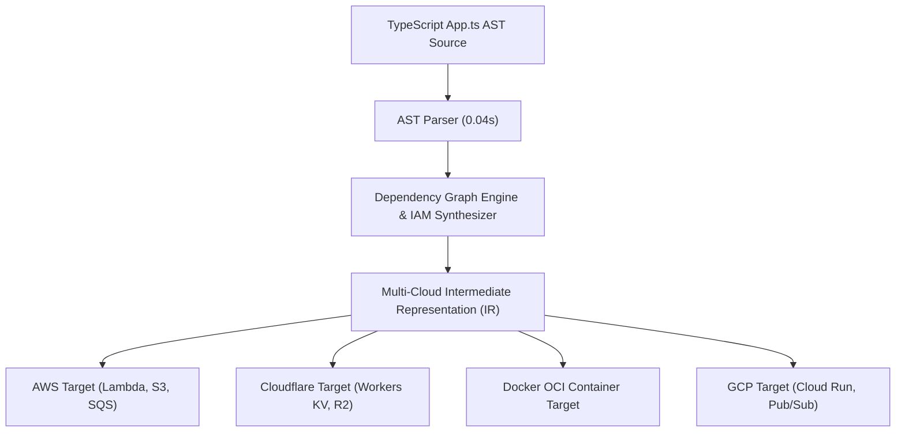

# NovaServe: Build Serverless. Compile to the Cloud.
> **The TypeScript-Native Serverless Framework**

[](https://www.npmjs.com/package/novaserve)
[](https://opensource.org/licenses/Apache-2.0)
[](https://nextjs.org/)
[](https://www.typescriptlang.org/)
[](https://novaserve.cloud)

**NovaServe** is the open-source TypeScript serverless framework. Build, develop, plan, and deploy serverless applications with TypeScript—powered by a compiler-driven infrastructure engine. It parses your TypeScript application code AST, automatically synthesizes zero-trust least-privilege IAM policies, generates Nova Intermediate Representation (Nova IR), and deploys serverless infrastructure to AWS and local emulator environments without writing raw YAML or HCL scripts.

---

## 🚀 Key Features

- **Open Source & Free for Individuals**: Published under Apache-2.0 license, completely free for developers and independent builders.
- **TypeScript AST Infrastructure Parsing**: Declare S3 buckets, SQS queues, PostgreSQL databases, and API routes natively in pure TypeScript.
- **Automated Least-Privilege IAM Synthesis**: Zero wildcard IAM permissions. NovaServe inspects API calls at build time and generates scoped IAM JSON automatically.
- **Multi-Cloud IR Targeting**: Single codebase compiles simultaneously to AWS Lambda/S3/SQS, Cloudflare Edge KV/Workers, Docker OCI images, and GCP Cloud Run.
- **Sub-Second Local Emulation (`nova dev`)**: Test HTTP routes, queues, and storage buckets locally on your workstation in under 200ms.
- **SHA-256 State Locking & Drift Remediation (`nova drift`)**: Detect manual cloud console drift and restore state locks with `nova drift --fix`.

---

## 👥 Core Maintainers & Lead Architects

- **Md Shadab Azam Ansari** (*Author & Lead Compiler Architect*)
  - 📧 Email: `md.shadab.azam.ansari@gmail.com`
  - 🌐 Portfolio: [md-shadab-azam-ansari.vercel.app](https://md-shadab-azam-ansari.vercel.app/)
  - 📦 NPM: [`novaserve@2.1.10`](https://www.npmjs.com/package/novaserve)
  - 🐙 GitHub: [`novaserve-cloud/novaserve`](https://github.com/novaserve-cloud/novaserve)

- **Mustakim Shaikh** (*Co-Maintainer & Open Source Core Contributor*)
  - 📧 Email: `Mustakimshaikhprof@gmail.com`
  - 🐙 GitHub: [`novaserve-cloud/novaserve`](https://github.com/novaserve-cloud/novaserve)
  - 🌐 Production Domain: [novaserve.cloud](https://novaserve.cloud)

---

## ⚡ Quickstart

### 1. Global CLI Installation
```bash
npm install -g novaserve
```

### 2. Scaffold a New Project
```bash
nova init my-nova-app --template nextjs-edge
cd my-nova-app
```

### 3. Define Architecture in `App.ts`
```typescript
import { defineApp, api, storage, queue } from "novaserve";

export const app = defineApp({
  name: "my-nova-app",
  region: "us-east-1",
});

export const uploads = storage("user-uploads", { public: false });
export const taskQueue = queue("task-processing");

export const httpApi = api.post("/tasks", async (req) => {
  const task = await req.json();
  await uploads.put(`task-${task.id}.json`, JSON.stringify(task));
  await taskQueue.push(task);
  return { status: "created", taskId: task.id };
});
```

### 4. Run Local Emulator
```bash
nova dev
```

### 5. Deploy to Cloud
```bash
nova deploy --target aws
```

---

## 🏗️ Compiler Architecture



---

## 💻 Web Control Plane Development

This repository contains the Next.js 15 web platform & documentation console for NovaServe.

### Local Development Setup

```bash
# Clone the repository
git clone https://github.com/MustakimShaikh01/Nova-Serve-offical.git
cd Nova-Serve-offical

# Install dependencies
npm install

# Run dev server
npm run dev
```

Open [http://localhost:3000](http://localhost:3000) in your browser.

### Type Check & Build

```bash
# Check TypeScript types
npx tsc --noEmit

# Production build
npm run build
```

---

## 📄 License & Compliance

Published under the **Apache License 2.0**. Free for commercial and open-source use.  
For security disclosures, please email `md.shadab.azam.ansari@gmail.com` or `Mustakimshaikhprof@gmail.com`.
