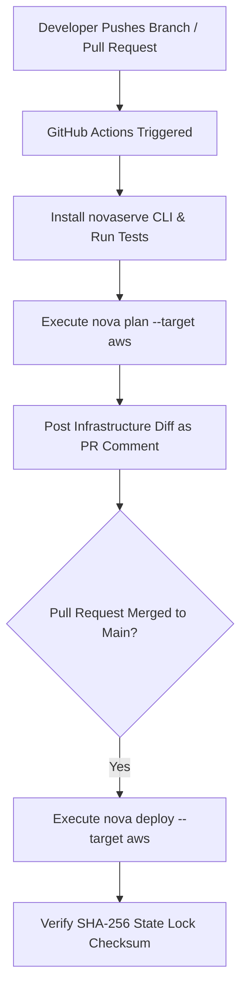

# CI/CD Deployment Automation Guide

This guide covers automating NovaServe compilation, infrastructure plan reviews, and zero-drift cloud deployments in Continuous Integration & Continuous Deployment (CI/CD) pipelines.

---

## Recommended CI/CD Workflow Model



---

## Official GitHub Actions Workflow Example

Create `.github/workflows/deploy.yml` in your repository root:

```yaml
name: NovaServe CI/CD Pipeline

on:
  push:
    branches: [ main ]
  pull_request:
    branches: [ main ]

jobs:
  plan-and-deploy:
    runs-on: ubuntu-latest

    steps:
      - name: Checkout Code
        uses: actions/checkout@v4

      - name: Setup Node.js 20
        uses: actions/setup-node@v4
        with:
          node-version: '20'
          cache: 'npm'

      - name: Install Project Dependencies
        run: npm ci

      - name: Install NovaServe CLI
        run: npm install -g novaserve@2.1.10

      - name: Configure AWS Credentials
        uses: aws-actions/configure-aws-credentials@v4
        with:
          aws-access-key-id: ${{ secrets.AWS_ACCESS_KEY_ID }}
          aws-secret-access-key: ${{ secrets.AWS_SECRET_ACCESS_KEY }}
          aws-region: us-east-1

      - name: Run Type Check & Tests
        run: |
          npx tsc --noEmit
          npm test

      # 1. Pull Requests: Generate & Review Infrastructure Plan
      - name: Preview NovaServe Infrastructure Plan
        if: github.event_name == 'pull_request'
        run: |
          nova plan --target aws

      # 2. Main Branch Merges: Execute Deployment & Update State Lock
      - name: Deploy NovaServe Application to Production
        if: github.event_name == 'push' && github.ref == 'refs/heads/main'
        run: |
          nova deploy --target aws
```

---

## GitLab CI Pipeline Configuration

Create `.gitlab-ci.yml`:

```yaml
image: node:20

stages:
  - test
  - plan
  - deploy

variables:
  AWS_REGION: "us-east-1"

before_script:
  - npm ci
  - npm install -g novaserve@2.1.10

test_app:
  stage: test
  script:
    - npx tsc --noEmit

plan_infrastructure:
  stage: plan
  script:
    - nova plan --target aws
  only:
    - merge_requests

deploy_production:
  stage: deploy
  script:
    - nova deploy --target aws
  only:
    - main
```

---

## CI/CD Best Practices

1. **Never Hardcode Secrets**: Pass `AWS_ACCESS_KEY_ID`, `AWS_SECRET_ACCESS_KEY`, and `CLOUDFLARE_API_TOKEN` via encrypted repository secrets.
2. **Automate Plan Previews on PRs**: Always run `nova plan` on pull requests to catch infrastructure diffs and unintended resource creations before merging.
3. **Commit State Locks**: Ensure your state lock file (`.nova/state.json`) or remote S3 state backend is kept in sync across pipeline runs.
